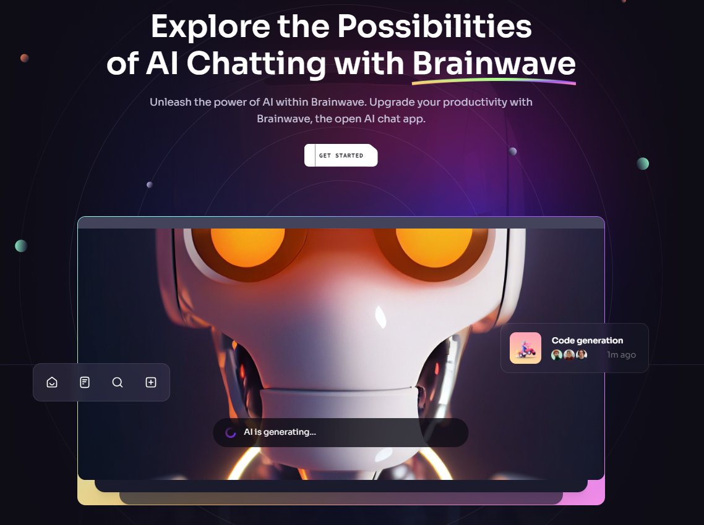
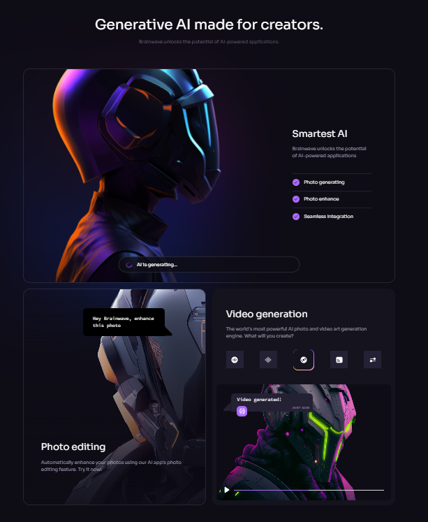
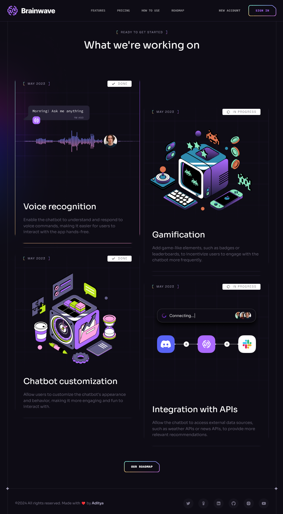

# Brainwave

Unleash the power of AI within Brainwave. Upgrade your productivity with Brainwave, the open AI chat app.

Its sleek design, seamless animations, and overall user experience set a high standard, serving as a reference or inspiration for future modern applications or websites in general.

See the [live demo](https://brainwave-aditya-2k23s-projects.vercel.app/).







## Tech Stack

- **React** with **Vite** for a fast development experience
- **Tailwind CSS** for styling
- **React Just Parallax** for parallax effect
- **ESLint** for linting
- **Prettier** for code formatting

## Getting Started

-- Clone the repository

```bash
git clone https://github.com/aditya-2k23/brainwave
```

-- Install the necessary dependencies

```bash
npm install
```

-- Start the development server

```bash
npm run dev
```

### React + Vite

This template provides a minimal setup to get React working in Vite with HMR and some ESLint rules.

Currently, two official plugins are available:

- [@vitejs/plugin-react](https://github.com/vitejs/vite-plugin-react/blob/main/packages/plugin-react/README.md) uses [Babel](https://babeljs.io/) for Fast Refresh
- [@vitejs/plugin-react-swc](https://github.com/vitejs/vite-plugin-react-swc) uses [SWC](https://swc.rs/) for Fast Refresh
